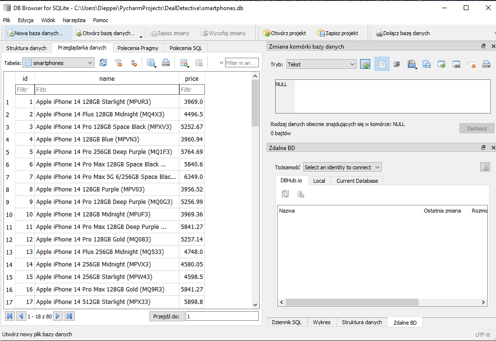
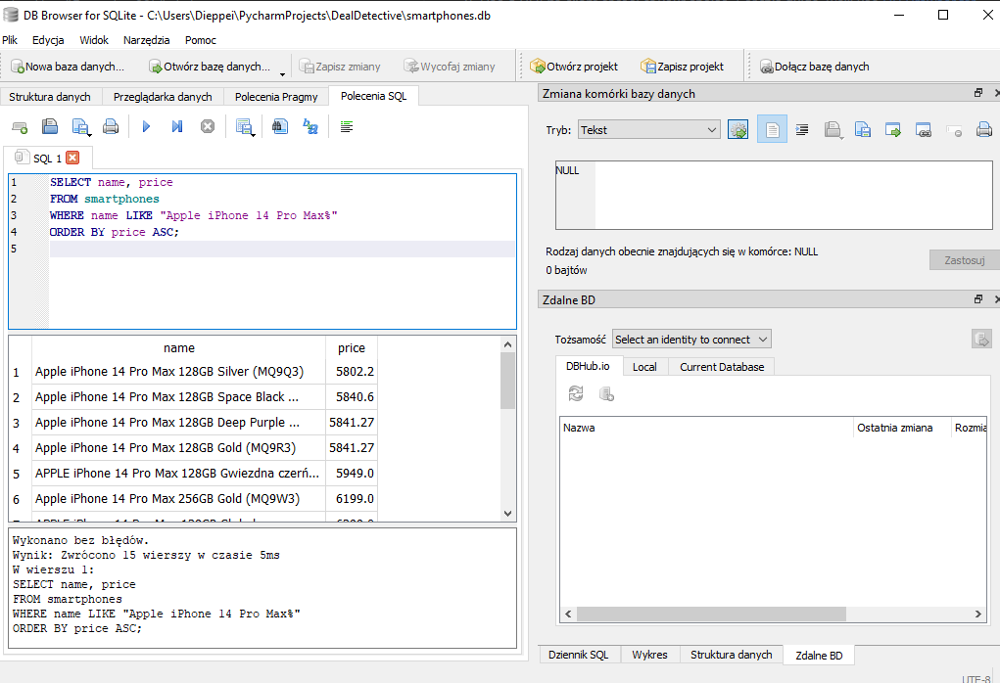

# Running the Database

This guide provides a step-by-step walkthrough of how to run queries on the SQLite database used by the Deal_Detective script.

## Setup

1. Ensure you have the `smartphones.db` SQLite database file generated by the Deal_Detective script.
2. Use a SQLite client or tool of your choice. For this guide, we'll use [DB Browser for SQLite](https://sqlitebrowser.org/).

## Running Queries

1. Open DB Browser for SQLite.
2. Click on "Open Database" and select the `smartphones.db` file.
3. Navigate to the "Execute SQL" tab.
4. In the SQL text area, you can input your SQL queries.

### Example Query

To fetch all the iPhone 14 Pro Max models sorted by their price in ascending order:

```sql
SELECT name, price 
FROM smartphones
WHERE name LIKE "Apple iPhone 14 Pro Max%"
ORDER BY price ASC;
```
### Database View


### Example Query



